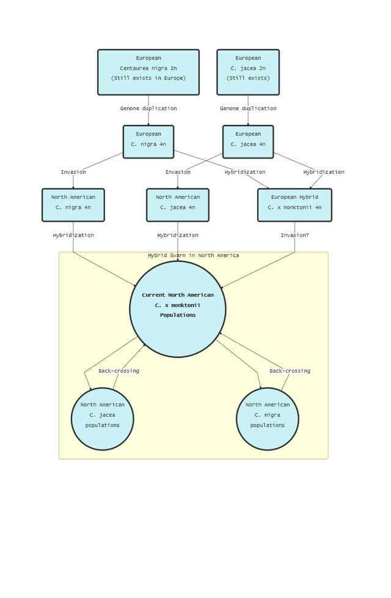

#Centaurea Hybrid Swarm Path Diagram



#Mock Data

##Different ways traits from C. jacea and C. nigra parents can be inherited by C. x monktonii offspring

* Hybrid Index of pure C. nigra = 0
* Hybrid Index of pure C. jacea = 1
* Hybrid Index of exact 50/50 hybrid = 0.5

### Offspring either have exact trait of C. jacea or exact trait of C. nigra.


```{r, eval = T, echo = F}
# Comments are important!
CentData <- read.csv("MockCentData.csv", header = T)

# now plot a graph
plot(x = CentData$Hybrid.Index,
     y = CentData$Trait.1,
     xlab = "Hybrid Index",
     ylab = "Trait")
```

### Offspring has a combination of parent traits.
* A perfect 50/50 hybrid has the midpoint of each of the parent traits.
```{r, eval = T, echo = F}
# now plot a graph
plot(x = CentData$Hybrid.Index,
     y = CentData$Trait.2,
     xlab = "Hybrid Index",
     ylab = "Trait")
```

### Offspring gets alleles from both parents and they have an additive effect.
* Hybrid vigor, hybrids are more fit than either parent.
```{r, eval = T, echo = F}
# now plot a graph
plot(x = CentData$Hybrid.Index,
     y = CentData$Trait.3,
     xlab = "Hybrid Index",
     ylab = "Trait")
```

### Offspring gets alleles from both parents, but they have a deleterious effect.
* Outbreeding depression, hybrids are less fit than either parent.
```{r, eval = T, echo = F}
# now plot a graph
plot(x = CentData$Hybrid.Index,
     y = CentData$Trait.4,
     xlab = "Hybrid Index",
     ylab = "Trait")
```